# CarND - Finding Lane Lines - Project 1
Udacity Self-Driving Car Engineer Nanodegree Program  

 

# Overview

The goal of the Project #1 is to make a pipeline that finds lane lines on the road using Python and OpenCV.

While the pipeline is created for a single image, it can be applied to video footage by breaking the video down into frames, passing the frames through the pipeline, and then reconstructing the video.

The pipeline will be tested on some images and videos provided by Udacity. The following assumptions are made:
- The camera always has the same position with respect to the road
- There is always a visible white or yellow line on the road
- We don't have any vehicle in front of us 
- We consider highway scenario with good weather conditions

My code for this project is publicly available and can be found here: https://github.com/ednaldogoncalves/CarND-LaneLines-P1

## Steps

- Set up the [CarND Term1 Starter Kit](https://classroom.udacity.com/nanodegrees/nd013/parts/fbf77062-5703-404e-b60c-95b78b2f3f9e/modules/83ec35ee-1e02-48a5-bdb7-d244bd47c2dc/lessons/8c82408b-a217-4d09-b81d-1bda4c6380ef/concepts/4f1870e0-3849-43e4-b670-12e6f2d4b7a7) if you haven't already.

- Open the code in a Jupyter Notebook

You will complete the project code in a Jupyter notebook.  If you are unfamiliar with Jupyter Notebooks, check out <A HREF="https://www.packtpub.com/books/content/basics-jupyter-notebook-and-python" target="_blank">Cyrille Rossant's Basics of Jupyter Notebook and Python</A> to get started.

Jupyter is an Ipython notebook where you can run blocks of code and see results interactively.  All the code for this project is contained in a Jupyter notebook. To start Jupyter in your browser, use terminal to navigate to your project directory and then run the following command at the terminal prompt (be sure you've activated your Python 3 carnd-term1 environment as described in the [CarND Term1 Starter Kit](https://github.com/udacity/CarND-Term1-Starter-Kit/blob/master/README.md) installation instructions!):

`> jupyter notebook`

A browser window will appear showing the contents of the current directory.  Click on the file called "P1.ipynb".  Another browser window will appear displaying the notebook.  Follow the instructions in the notebook to complete the project.

- Complete the project and submit both the Ipython notebook and the project writeup

## Reflection

### Pipeline

I will use the following picture to show you all the steps: 

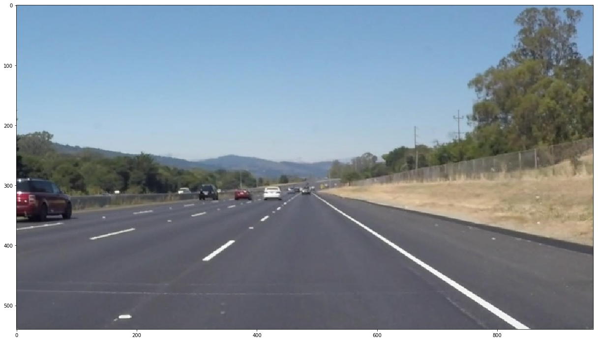

### Color selection

I applied a color filtering to suppress non-yellow and non-white colors. The pixels that were above the thresholds have been retained, and pixels below the threshold have been blacked out.  This is the result that it will be used this mask later: 

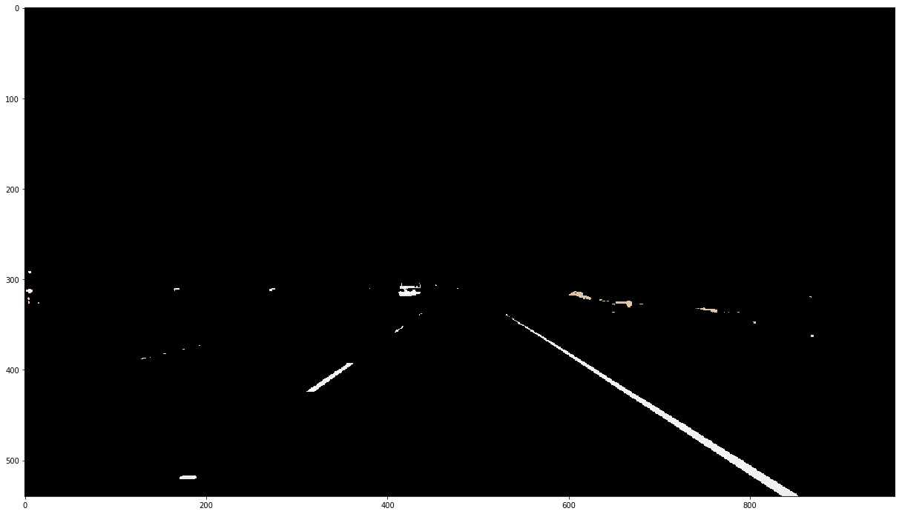

After doing so, we can observe how the yellow and the white of the lanes are very well isolated, as like you see on this other picture (solidYellowLeft.jpg): 

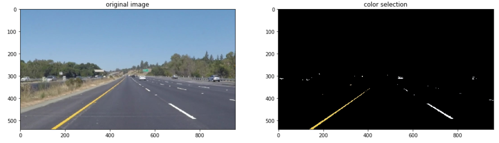

The results are very satisfying so far. See how the yellow road signs are clearly identified.

### Convert the color image in grayscale

The first thing we do with the raw image is convert it to grayscale. Not only does this reduce the amount of data and complexity we are dealing with, but it also benefits other steps like Canny Edge Detection. In this way we have only one channel: 

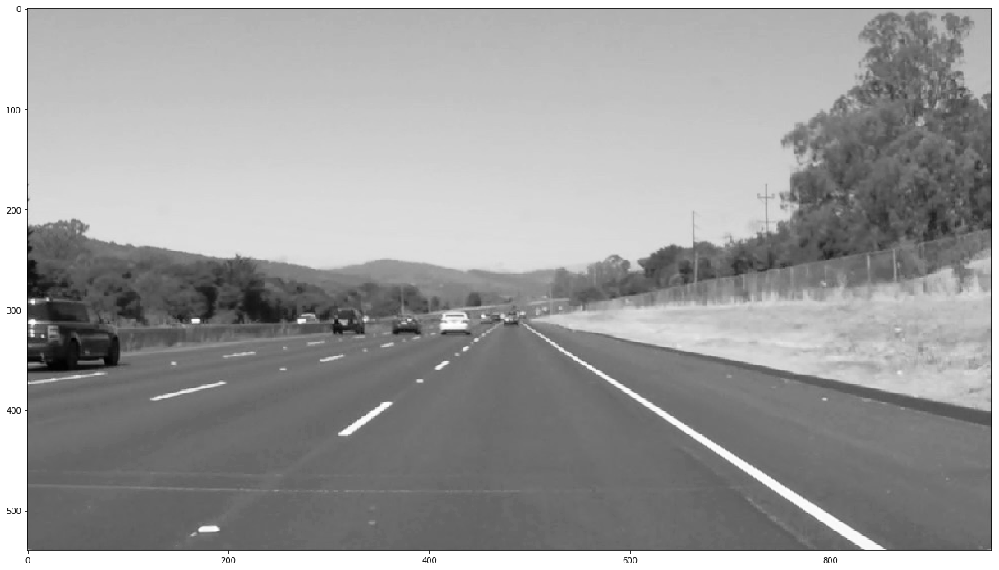

### Apply a slight Gaussian blur
  
Before edge detection, we want to smooth out the image some. Applying a Gaussian Blur will cut down on visual noise and ensure that only the sharpest edges get through. The OpenCV implementation of Gaussian Blur takes a integer kernel parameter which indicates the intensity of the smoothing. 
The images below show what a typical Gaussian blur does to an image, the original image is on the left while the blurred one is to its right. 

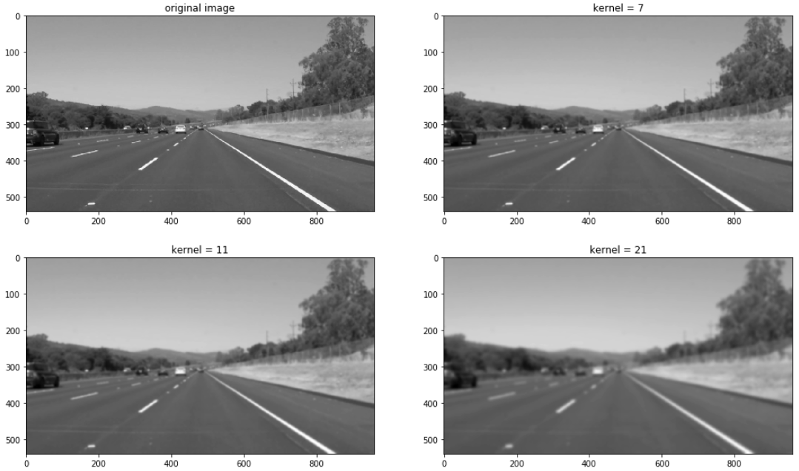

For our task we choose a value of _7_.

### Perform Canny edge detection

Canny edge detection is an algorithm that measures the change in connected pixel values (the gradients). We use it to turn our image into pure black and white where white represents the largest gradients - the most drastic changes in connected pixel values. These represent our “edges” in the original image.

Essentially, is a way of suppressing noise and spurious gradients by averaging. The Canny allows detecting the edges in the images.

Now that we have sufficiently pre-processed the image, we can apply a Canny Edge Detector, whose role it is to identify lines in an image and discard all other data. The resulting image which enables us to focus on lane detection even more, since we are concerned with lines.

The OpenCV implementation requires passing in two parameters in addition to our blurred image, a low and high threshold which determine whether to include a given edge or not. A threshold captures the intensity of change of a given point (you can think of it as a gradient). Any point beyond the high threshold will be included in our resulting image, while points between the threshold values will only be included if they are next to edges beyond our high threshold. Edges that are below our low threshold are discarded. 

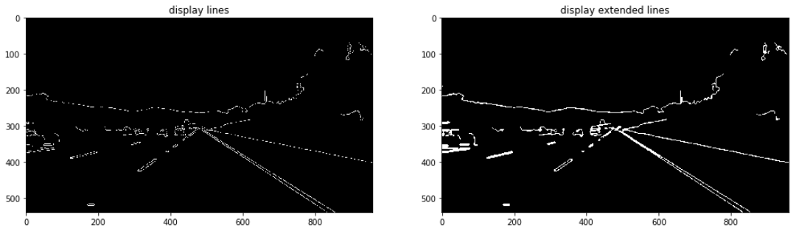

#### Merge Canny and Color Selection

In some cases, the Canny edge detector fails to find the lines. For example, when there is not enough contrast between the asphalt and the line, as in the challenge video (see section ‘Optional challenge’). The color selection, on the other hand, doesn't have this problem. For this reason, I decided to merge the result of the Canny detector and the color selection: 

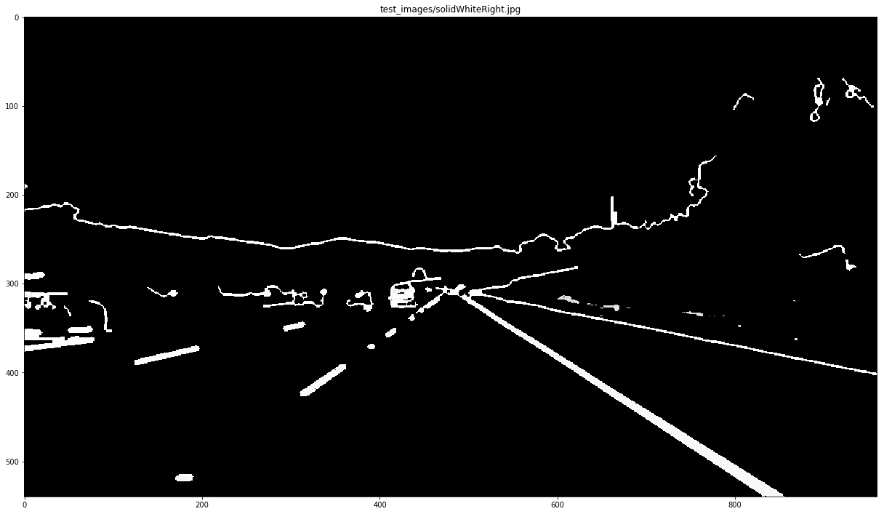

### Define a region of interest and mask image

I defined a left and right trapezoidal Region Of Interest (ROI) based on the image size. Since that the front facing camera is mounted in a fix position, we supposed here that the lane lines will always appear in the same region of the image, and lanes are flat, therefore we can identify the critical region we are interested in.

Our next step is to determine a region of interest and discard any lines outside of this polygon. We apply a region of interest that allows us to ignore white pixels where lane lines shouldn’t be.

We put the canny and segmented images side by side and observed how only the most relevant details have been conserved: 

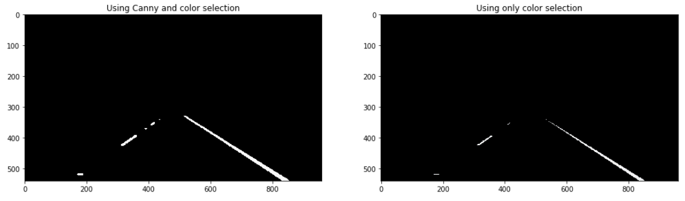

### Run Hough transform

The Hough transform is used to detect lines in the images. At this step, I applied a slope filter to get rid of horizontal lines.

After we have our regioned-out edges from the Canny algorithm, we pass the image through a Hough Transform. 

In a basic sense, the Hough Transform will scan the image and detect where pixels form lines. If we set our parameters correctly, this will return our lane lines. 

This is the result: 

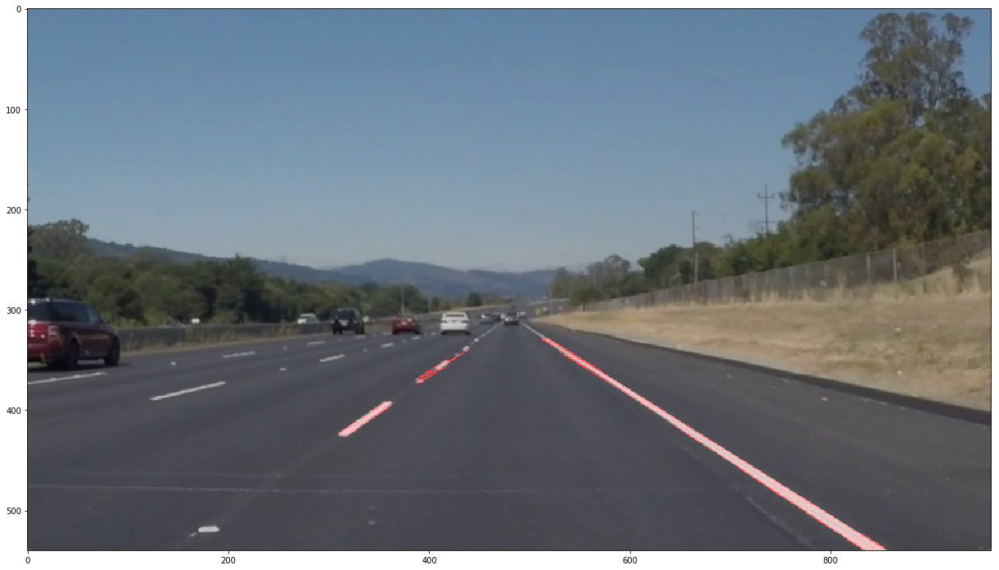

### Apply lines to the original image

The last step we simply draw the final lines onto the original image. I created the average lines function to take the line information output by the Hough Transform and reduce it down to two lines - our ideal lane lines. This mostly works by comparing the slopes of the lines. We ignore lines with slopes too horizontal - those won’t be lane lines. We then group the lines by positive and negative slopes - our right and left lane lines. From that separate line information we average the points together and extrapolate out to the top of our region of interest and the bottom of the screen. This gives us two solid lane lines, and I could draw them onto the original picture: 

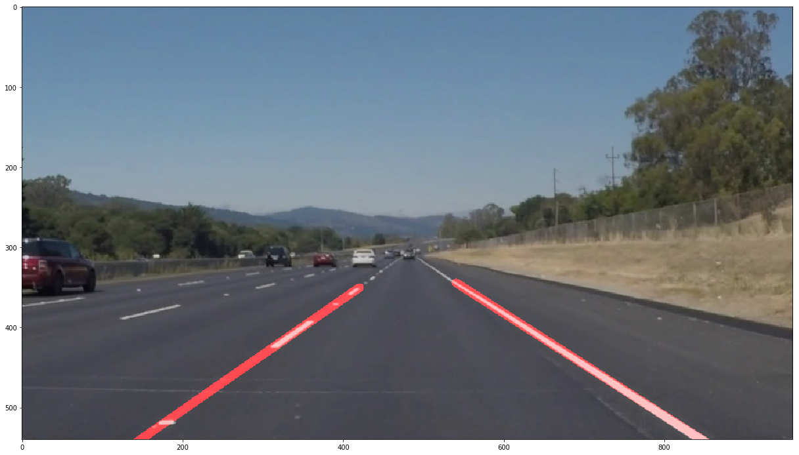

 
## Results:

### Pictures

Here some results on test images provided by Udacity: 

result_solidWhiteCurve.jpg 

result_solidWhiteRight.jpg 

result_solidYellowCurve.jpg 

result_solidYellowCurve2.jpg 

result_solidYellowLeft.jpg 

result_whiteCarLaneSwitch.jpg 

You can find the original pictures and the results in the folder 'test_images'

### Videos

Here some results on test videos provided by Udacity:

You can find the video files on this folder: ‘test_videos_output”

Solid white line 
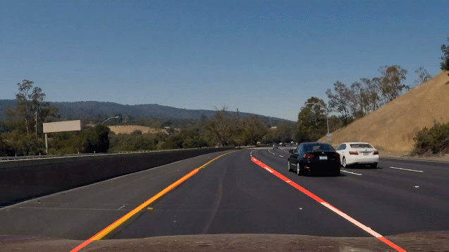 
<a href="./test_videos_output/result_challenge.mp4">Download video</a>

Solid yellow line 
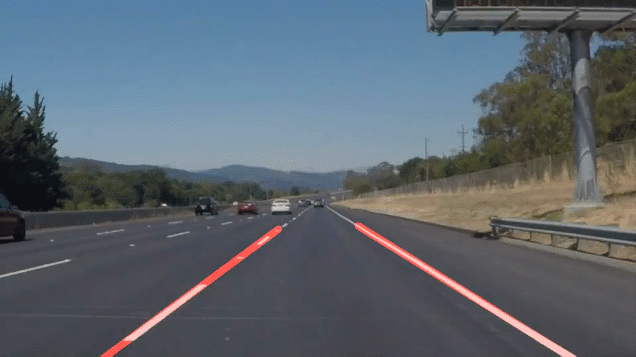 
<a href="./test_videos_output/result_solidWhiteRight.mp4">Download video</a>

Solid yellow line 
 
<a href="./test_videos_output/result_solidYellowLeft.mp4">Download video</a>

#### Identify potential shortcomings with your current pipeline

I have observed some problems with the current pipeline:
- in the challenge video around the second 4, the lane gets the lighter asphalt on top of the bridge and in the second 5 is covered by some shade and I believe my code can not detect it.straight lines do not work when there are curves on the road;
- Hough Transform is tricky to get right with its parameters. I am not sure I got the best settings;
- The algorithm isn’t super smart, so the smallest of edges in the middle of the road (if detected; through Canny Edge Detection) will severely limit the region of interest, usually causing lane lines to go completely undetected;
- This approach could not work properly:
	- if the camera is placed at a different position;
	- if other vehicles in front are occluding the view;
	- if one or more lines are missing;
	- at different weather and light condition (fog, rain, or at night).

#### Suggest possible improvements to your pipeline

- Perform a color selection in the HSV space, instead of doing it in the RGB images;
- Update the ROI mask dynamically;
- Perform a segmentation of the road;
- Using a better filter to smooth the current estimation, using the previous ones;
- If a line is not detected, we could estimate the current slope using the previous estimations and/or the other line detection;
- Use a moving-edges tracker for the continuous lines.